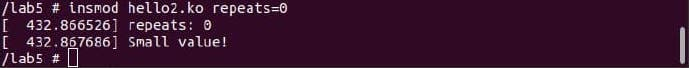

# AK2-lab5

Basic:

modinfo hello:

Запуск модуля hello:

Advanced:

modinfo модуля hello1

modinfo модуля hello2

запуск модуля hello2 без параметрів

запуск модуля hello2 з параметром 12

запуск модуля hello2 з параметром 6

запуск модуля hello2 з параметром 2

запуск модуля hello2 з параметром 0

dmesg

